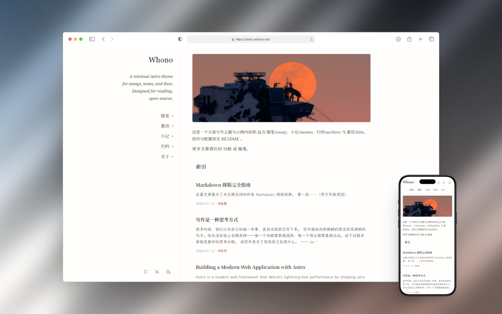
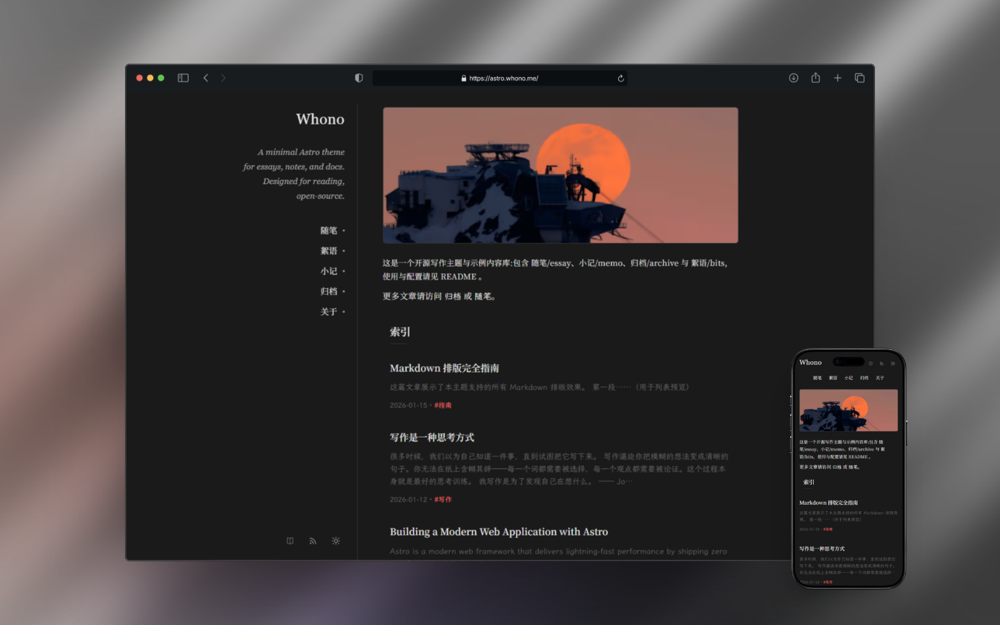

# astro-whono

[中文](README.md) | [English](README.en.md)

[](https://github.com/cxro/astro-whono/actions/workflows/ci.yml)  [](README.en.md#requirements)  [](https://docs.astro.build/)  [](LICENSE)

**✨ astro-whono supports visual writing and live preview in the local admin console**

A minimal two-column Astro theme for personal writing and lightweight publishing.

## Links

- Live demo: <https://astro.whono.me>
- Repository: <https://github.com/cxro/astro-whono>


## Preview

<p align="center">
  
  
</p>


## Features

- Two-column layout (sidebar navigation + content area)
- Responsive design for mobile devices
- Content collections: essay / bits / memo / about (archive is generated from essay)
- Built-in local Admin Console (`/admin`): manage site settings, content, and image assets in development
- Bits draft generator on `/bits/`: one-click Markdown output (copy/download), with multi-image support and automatic image dimension detection
- RSS: default archive feed + section feeds
- Light / dark theme + reading mode


## Getting Started

### Requirements

- Node.js 22.12+ (`.nvmrc` recommended)


### Quick Start

```bash
npm install
npm run dev
```

<details>
  <summary>Windows (PowerShell) note</summary>

If execution policy blocks `npm.ps1`, use one of the following:

- `cmd /c npm run ...`
- Or use Git Bash / WSL
</details>


### Common Commands

  - `npm run dev`: start the local dev server
  - `npm run build`: generate the static site
  - `npm run preview`: preview the production build
  - `npm run new:bit`: create a bits draft

<details>
  <summary>Maintainer checks</summary>

These commands are for maintaining the theme itself. Regular writing and deployment usually do not require them.

```bash
# Baseline verification: Astro check, Vitest, build
npm run verify

# Markdown rendering contract: run after changing rendering, article styles, or the code block toolbar
npm run build
npm run check:markdown-smoke

# Release artifact check: requires the final production domain
SITE_URL=https://your-domain npm run build
SITE_URL=https://your-domain npm run check:prod-artifacts

# Admin boundary check: only when changing /admin/** or /api/admin/**
npm run check:preview-admin

# Production dependency audit: run before release or after dependency changes
npm run audit:prod
```
</details>


## Deployment

### One-click Deploy

[](https://vercel.com/new/clone?repository-url=https://github.com/cxro/astro-whono)&nbsp;&nbsp;[](https://app.netlify.com/start/deploy?repository=https://github.com/cxro/astro-whono)&nbsp;&nbsp;[](https://dash.cloudflare.com/?to=/:account/workers-and-pages)

> For production, set: `SITE_URL=https://your-domain` (without a trailing slash).
> If not set, the site can still run, but link metadata for sharing/indexing may be incomplete.

<details>
  <summary><strong>Cloudflare Pages deployment (manual repository import)</strong></summary>

**Build settings**
- Framework preset: `Astro`
- Build command: `npm run build`
- Output directory: `dist`

**Node.js version (usually not required)**
- This project includes `.nvmrc`, and Cloudflare Pages reads it automatically.
- If you need to set it manually, add `NODE_VERSION=22.22.0` in environment variables.

**Environment variables (set for production)**
- In Pages project -> Settings -> Environment variables, add: `SITE_URL=https://your-domain` (for example `https://astro.whono.me`, without a trailing `/`).
- `SITE_URL` is used to generate absolute links for canonical, Open Graph `og:url`, RSS, and sitemap; without it these links fall back to a placeholder domain, hurting share previews and search indexing.

**About sitemap / robots**
- `sitemap` is generated only when `SITE_URL` is set, and `/robots.txt` includes a `Sitemap:` line only in that case (to avoid pointing to the wrong domain).

</details>

<details>
<summary><strong>Post-deploy checklist</strong></summary>

- Home page / list pages / detail pages are accessible
- RSS endpoints are accessible (`/rss.xml` and section feeds)
- With `SITE_URL` set: canonical / `og:url` point to your domain
- No network requests to demo-domain resources

</details>


## Configuration and Entry Points

### Project Entry Points

- Site config: `site.config.mjs`
- Content collections: `src/content.config.ts`
- Shared style entry: `src/styles/global.css`
- Page / scene style entries: `src/styles/home.css`, `src/styles/about.css`, `src/styles/memo.css`, `src/styles/article.css`, `src/styles/bits-page.css`
- Admin style entry: `src/styles/components/admin/shell.css` + route-specific styles under `src/styles/components/admin/**`; the full `admin.css` aggregate is no longer provided

### Admin Console (`/admin`)

The built-in local Admin Console targets development only, for viewing the site overview, adjusting theme settings, editing content, and importing/exporting settings snapshots.

Run `npm run dev`, then open `http://localhost:4321/admin/` (replace `4321` with your actual port if changed).

| Entry | Purpose |
| :---: | :--- |
| `/admin/` | Stable Admin entry and Site Overview |
| `/admin/theme/` | Theme Console for editing site information, sidebar, home page, inner-page copy, and more |
| `/admin/images/` | Image resource browser and path helper |
| `/admin/data/` | Settings snapshot export / dry-run import / confirmed write |
| `/admin/content/` | Local editing, draft creation, and source export for essay / bits / memo / about |

> Guides: [Admin Console](https://astro.whono.me/archive/admin-console-guide/) · [Theme Console](https://astro.whono.me/archive/theme-console-guide/) · [Content Console](https://astro.whono.me/archive/content-console-guide/)

Production builds remain static output: `/admin/` can show a read-only public Overview or a hidden-state message based on Theme settings; other Admin subroutes and `/api/admin/**` are available in local development only.

#### Compatibility for existing forks

- If `src/data/settings/*.json` does not exist yet, the frontend still reads config via `settings > legacy > default`
- The JSON files are generated only after the first save in `/admin/theme/`; no manual migration is required


## Content and Writing

Content collections, source locations, and public entry points:

| Type | Source | Main routes |
| --- | --- | --- |
| Essay | `src/content/essay/` | `/essay/`, `/archive/`, `/archive/[slug]/` |
| Bits | `src/content/bits/` | `/bits/` |
| Memo | `src/content/memo/index.md` | `/memo/` |
| About | `src/content/about/index.md` | `/about/` |

- Essay and Bits are multi-entry collections; Memo and About are fixed single pages.
- `draft: true` is visible only in local development; production lists and feeds filter drafts. Memo should not be marked as draft.
- `essay.archive: false` removes an essay from the `/archive/` aggregation and archive feed, but it remains available through `/essay/`, its detail route, and the essay feed.
- Admin Console image uploads use local storage by default; AWS S3, Cloudflare R2, and MinIO are supported as optional S3-compatible storage.
- For image upload, frontmatter, dates, and excerpts, see the [Content Console guide (Chinese)](https://astro.whono.me/archive/content-console-guide/). For Callout, Figure, Gallery, and math syntax, see the [Markdown formatting guide (Chinese)](https://astro.whono.me/archive/markdown-guide/).


## Fonts and Licensing

This theme uses two typeface families (self-hosted + subsetted):
- Noto Serif SC (400 / 600)
- LXGW WenKai Lite (Regular)

The repository includes subsetted WOFF2 files (`latin` / `cjk-common` / `cjk-ext`, loaded on demand via `unicode-range`), so you can use the project immediately after cloning.
Subset charset is generated from repository text plus `tools/charset-base.txt` (3,500 common characters) to reduce missing-glyph cases.

To regenerate subsets after glyph gaps or source font changes, run `npm run font:build`; steps and file list below.

<details>
  <summary>Subset regeneration and file list</summary>

1. Install Python 3, run `python -m pip install fonttools brotli zopfli`, and make sure `pyftsubset --help` works (add the Python Scripts directory to `PATH` if not)
2. Put the source fonts in `tools/fonts-src/`
3. Run `npm run font:build`; if glyphs are missing, add the characters to `tools/charset-base.txt` and rerun
4. `tools/charset-common.txt` is regenerated by `npm run font:charset`; do not edit it by hand

Subset files (tracked in repository):
- `public/fonts/lxgw-wenkai-lite-latin.woff2`
- `public/fonts/lxgw-wenkai-lite-cjk-common.woff2`
- `public/fonts/lxgw-wenkai-lite-cjk-ext.woff2`
- `public/fonts/noto-serif-sc-400-latin.woff2`
- `public/fonts/noto-serif-sc-400-cjk-common.woff2`
- `public/fonts/noto-serif-sc-400-cjk-ext.woff2`
- `public/fonts/noto-serif-sc-600-latin.woff2`
- `public/fonts/noto-serif-sc-600-cjk-common.woff2`
- `public/fonts/noto-serif-sc-600-cjk-ext.woff2`

Source files (not tracked in repository):
- `tools/fonts-src/LXGWWenKaiLite-Regular.woff2`
- `tools/fonts-src/NotoSerifSC-Regular.ttf`
- `tools/fonts-src/NotoSerifSC-SemiBold.ttf`
</details>

Font license: SIL Open Font License 1.1 (see `public/fonts/OFL-LXGW-WenKai-Lite.txt` and `public/fonts/OFL-NotoSerifSC.txt`).

### Typography settings

In development, open the Theme Console (`/admin/theme/` → "Typography") to configure the body text, copy, monospace, and brand fonts independently; changes apply on the next build. Options include system fonts, self-hosted fonts, and online fonts downloaded and self-hosted at build time — browsers never contact third-party font services. Fonts beyond the built-in options are registered in `src/lib/fonts/registry.ts`. See the [Theme Console guide → "Typography"](https://astro.whono.me/archive/theme-console-guide/) for details.

Run `npm run check:font-charset` to verify that the charset and font subsets match the site content. If it fails, follow the prompt to run `npm run font:build`.

### Site icon settings

In development, open the Theme Console (`/admin/theme/` → "Site" → site icons) to upload square PNG files for the browser tab favicon and the mobile touch icon. Uploads are written to `public/images/site/` with content-hash file names, so replaced icons are not affected by browser favicon caching; changes apply after saving and rebuilding.

Once either tab icon slot (SVG or PNG) is customized, the other empty slot no longer emits the theme default icon, so browsers do not keep showing the default logo; the touch icon falls back independently and keeps the theme default until customized. SVG upload is not supported in the console yet; replace `public/favicon.svg` directly, or point `favicon.svg` in `src/data/settings/site.json` at an SVG under `public/**`.


## RSS

- `/rss.xml` (default feed; uses the same archive items as `/archive/rss.xml`)
- `/archive/rss.xml` (archive feed)
- `/essay/rss.xml`

Setting `SITE_URL` is recommended for deployment (affects absolute links in RSS/OG/canonical).


## Contributing

Issues are welcome for bug reports and ideas.
Pull requests are welcome; using a `feature/*` branch is recommended.

### Sync Upstream in a Fork

```bash
git remote add upstream https://github.com/cxro/astro-whono.git
git fetch upstream --tags
git checkout main
git merge upstream/main
git push origin main --tags
```


## Acknowledgements

- Thanks to [elizen/elizen-blog](https://github.com/elizen/elizen-blog), the starting point of this theme design, which is inspired by the Hugo theme [yihui/hugo-ivy](https://github.com/yihui/hugo-ivy)


## License

License: MIT
