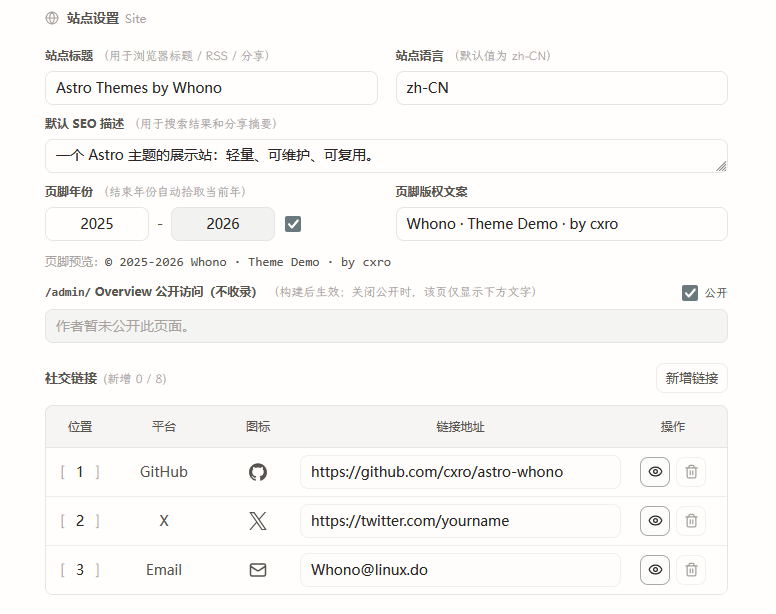
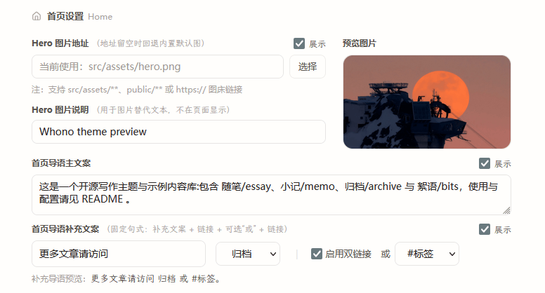
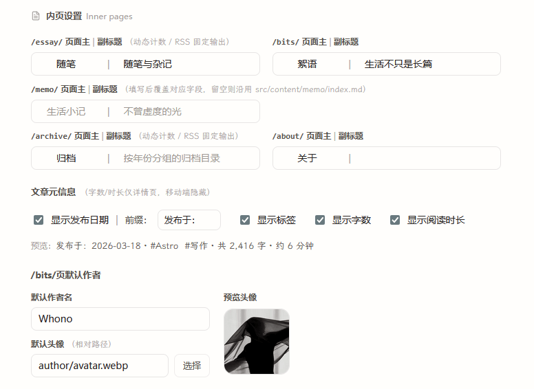

astro-whono 提供一个本地 Theme Console，用于在开发环境中集中管理主题级配置。

Theme Console 的入口是 `/admin/theme/`。它主要覆盖站点信息、侧栏、首页、内页文案，以及部分阅读与代码显示选项，便于在 fork 或 clone 后快速调整站点主题设置。

:::note[开发环境]
`/admin/theme/` 仅在开发环境可操作。生产环境访问时，只显示本地开发提示，不提供写入能力。
:::

## 本地启动与入口

本地开发时，可通过以下命令启动项目：

```bash
npm install
npm run dev
```

默认情况下，开发服务器会运行在 `http://localhost:4321/`。启动后可直接访问：

```text
http://localhost:4321/admin/theme/
```

如果本地修改了开发端口，请将 `4321` 替换为实际端口。

`/admin/` 是后台的 Site Overview 入口，用于查看站点快照。Theme Console 位于 `/admin/theme/`，使用时注意区分这两个入口。

## 开发与生产环境

Theme Console 是面向本地维护者的配置工具，不同环境下的表现如下：

- 开发环境：`/admin/theme/` 可读取和保存主题配置
- 生产环境：`/admin/theme/` 只保留本地开发提示，不显示可写表单
- `/api/admin/settings/`：仅开发环境可用，不作为公开 API 使用

## 适用范围

Theme Console 当前适合处理以下几类配置：

- 站点标题、默认语言、默认 SEO 描述
- 站点图标（浏览器标签页 / 触摸图标）
- 页脚年份与版权文案
- `/admin/` Overview 对外展示开关与关闭态文案
- 社交链接及其排序
- 侧栏站点名、引用文案、导航顺序与显隐
- 侧栏动作图标（阅读模式 / RSS / 主题切换 / 站点概览入口）
- 首页 Hero、首页导语及首页内部入口
- `/essay/`、`/archive/`、`/bits/`、`/memo/`、`/about/` 的主副标题
- 文章元信息显示选项
- 代码块行号
- 正文 / 文案 / 等宽 / 品牌四个角色的排版字体


## 配置文件

保存后的设置会按分组自动写入 `src/data/settings/`：

```text
src/data/settings/
  site.json
  shell.json
  home.json
  page.json
  ui.json
```

> 若 `src/data/settings/*.json` 尚不存在，首次在 `/admin/theme/` 保存时会自动生成。

Theme Console 管理的是仓库内的主题配置，相关改动仍可通过 Git 进行跟踪和回退。

主题配置的读取顺序固定为：`src/data/settings/*.json` 优先，其次读取 legacy 配置，最后使用项目默认值。这里的 legacy 配置主要来自 `site.config.mjs` 和组件内默认常量。<br>
也就是说，刚 clone 项目时可以先使用默认配置；只要在 Theme Console 中保存过一次，就会生成可跟踪的 settings JSON。

## 页面分组

`/admin/theme/` 当前按编辑场景拆分为五组。

### Site

`Site` 负责站点层面的基础信息：

- 站点标题
- 默认语言
- 默认 SEO 描述
- 页脚年份与版权文案
- `/admin/` Overview 是否对外展示，以及关闭时显示的文案
- 站点图标（浏览器标签页 / 触摸图标）
- 社交链接

站点图标支持上传正方形 PNG（16-512px，256KB 以内），分别对应浏览器标签页图标与移动端触摸图标；文件以内容哈希命名写入 `public/images/site/`，替换后不受浏览器图标缓存影响。自定义标签页图标后，主题默认的 SVG / PNG 图标不再输出；触摸图标独立回退，未自定义时保持主题默认。图标文件缺失时站点自动回退主题默认图标，不影响构建。SVG 图标暂不支持上传，可直接替换 `public/favicon.svg`（手工维护的固定路径不带缓存戳，替换内容后浏览器可能仍显示旧图标）。

> 

### Sidebar

`Sidebar` 负责壳层与导航相关配置：

- 侧栏站点名
- 侧栏引用文案
- 侧栏分隔线样式
- 侧栏动作图标显隐（阅读模式 / RSS / 主题切换 / 站点概览）
- 导航名称、排序、后缀字符与显隐状态

> 

### Home

`Home` 负责首页展示相关配置：

- Hero 图片地址与说明文字
- Hero 显隐
- 首页导语主文案
- 首页导语补充文案
- 补充导语中的主链接与第二链接

> 

首页补充导语仍采用固定句式，后台只开放了文案和入口选择，尽量保持首页结构稳定。当前可选入口包括 `archive`、`essay`、`bits`、`memo`、`about` 和 `tag`。


### Inner Pages

`Inner Pages` 负责内页层面的统一文案与显示策略：

- `/essay/` 页面主副标题
- `/archive/` 页面主副标题
- `/bits/` 页面主副标题
- `/memo/` 页面主副标题
- `/about/` 页面主副标题
- 文章元信息是否显示日期、标签、字数、阅读时长
- `/bits/` 默认作者名与头像

> 


### Code

- 是否在代码块中显示行号

### Typography

`Typography` 负责四个排版字体角色的选择：

- 正文字体（文章正文与标题）
- 文案字体（导语、关于页等场景）
- 等宽字体（代码块与行内代码）
- 品牌字体（侧栏站点名与引言）

保存后写入 `src/data/settings/ui.json`，下次构建生效。字体的来源、体积与添加自定义字体的方式见下文「排版字体」。


## 排版字体

四个字体角色各自从一组字体卡片中选择：卡片以该字体实际渲染预览字样，并标注来源徽章，选中后卡片下方显示全称与体积详情，便于按需取舍。内置选项分三类来源：

- **系统字体**：使用访客设备上已有的字体，不产生下载。
- **自托管字体**：字体文件随站点构建产物一并分发，访客不经过任何外部 CDN，页面不请求第三方。
- **在线获取字体**：构建时从开源字体库（fontsource / Google Fonts）下载后自托管，页面同样零第三方请求，但构建机需要能访问对应字体源。

中文字体单字重通常在 1 MB 以上，系统字体则零下载，可据此在观感与体积之间权衡。

### 添加卡片列表以外的字体

卡片选项来自字体注册表 `src/lib/fonts/registry.ts`。需要列表之外的字体时，在 `THEME_FONT_REGISTRY` 末尾补上这款字体的一段配置即可，选择卡片、校验与页面样式随之生效，无需改动其他文件。

为保证构建可复现、页面无第三方请求，注册表只接受预先登记的字体，界面不支持直接填写任意字体名。每款字体按获取方式选择一种写法，各字段含义见文件内注释：

| 获取方式 | 适用场景 | 关键字段 |
|---|---|---|
| `system` | 系统字体栈 | `fallbacks`；不产生下载 |
| `astro-fonts-api` | 开源在线字体 | `provider`（`fontsource` 在中国大陆可用性较好 / `google` 需可访问 fonts.google.com）、`familyName`；中文字体须声明 `subsets`（如 `['chinese-simplified', 'latin']`），否则中文字形不会被打包 |
| `astro-fonts-api` + `provider: 'local'` | 离线或无外网构建 | 字体文件放入 `src/assets/fonts/` 并填写 `localVariants`，构建不依赖网络 |
| `subset-pipeline` | 需要中文子集化压缩 | 另需源字体、`scripts/font-subset.mjs` 与 `global.css` 配套，参照现有默认字体 |

在线获取的字体若构建时下载失败，页面会自动回退到系统字体、构建不中断；运行 `SITE_URL=... npm run check:prod-artifacts` 会将这类静默降级报为显式错误。开发模式下切换这类字体后，需要重启开发服务器才能看到效果。


## 保存机制

- 保存按 `site / shell / home / page / ui` 分组回写，不直接修改模板源码
- 多数字段提供即时预览或明确的页面对应关系
- 保存前会执行字段校验
- 保存时会附带版本信息，用于避免并发修改造成的静默覆盖
- 写入过程包含失败回滚，避免多文件半成功状态

---

以上内容覆盖了 Theme Console 当前常用的配置入口与保存机制。如果在使用时发现配置异常或保存问题，欢迎提交 Issue。
